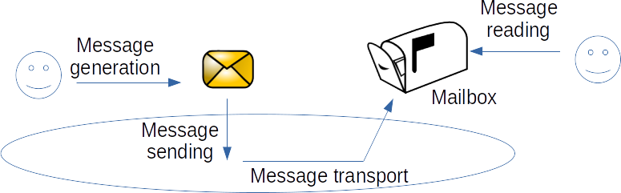

## Implementing messaging communication in Mesa

With the Mesa library, it is possible to set up indirect interaction mechanisms through the environment (like a blackboard). However, it does not handle direct interactions such as message communication. So, first, we will implement our own communication layer in Mesa. 

As seen previously, the messaging communication in MAS is a four step mechanism.

Before implementing the communicating agents and according to the picture, we must create: (1) a `Message` object, (2) a `Mailbox` object and (3) a list of allowed performative for messages. To do so, we create a new folder hierarchy containging: 

1- **mesa**: root folder which will contain your python codes using the communication layer;

2- **communication**: the root folder of the communication layer;

3- **agent**: the folder which will contain the implementation of the communicating agent class. Such that: 

- A communicating agent (sender) builds a message;
- A communicating agent (sender) invokes a send method in the environment (through the MessageService) to send the message, as one of its actions;
- The environment (through the MessageService) drops the message in the mailbox of the communicating agent (receiver). This can be done either instantly or not.
- A communicating agent (receiver) reads its mailbox, either in a systematic manner as part of the perception mechanism in the procedural loop (passive perception) or on purpose, by calling a specific method (active perception).

The three attributes of the CommunicatingAgent class are:

- name: the name of the communicating agent which replaces the unique id of Mesa Agent class;
- mailbox: the agent’s unique and private mailbox;
- message_service: the reference to the message service instantiated in the environment.

The acceessor method of the CommunicatingAgent class is:

- get_name(): return the unique name of the communicating agent.

The seven methods of the CommunicatingAgent class are:

- step(): the step() methods of the communicating agent called by the Mesa Scheduler at each time tick;
- receive_message(message): receive a message (called by the MessageService) and store it in the mailbox;
- send_message(message): send message through the MessageService (messages_service.send_message(message));
- get_new_messages(): return all the unread messages;
- get_messages(): return all the received messages;
- get_messages_from_performative(performative): return a list of messages which have the same performative;
- get_messages_from_exp(exp): return a list of messages which have the same sender.

4- **mailbox**: the folder which will contain the implementation of the mailbox class. To manage messages, each communicating agent will have his own mailbox. The purpose of this class is to provide to agents some mechanisms for handling sent and received messages. The Mailbox class is composed of two attributes and five methods.

The two attributes of the Mailbox class are:

- unread_messages: the list of unread messages;
- read_messages: the list of read messages.

The five methods of the Mailbox class are:

- receive_messages(message): receive a message and add it in the unread messages list;
- get_new_messages(): return all the messages from unread messages list;
- get_messages(): return all the messages from both unread and read messages list;
- get_messages_from_performative(performative): return a list of messages which have the same performative;
- get_messages_from_exp(exp): return a list of messages which have the same sender.

5- **message**: the folder which will contain the implementation of the message and performative class. The purpose of this Message class is to create a python message object containing the receiver and sender identifiers but also the performative of the message sent as well as a content. Agents will exchange information using these items during their communication phases. The Message class is therefore composed of four attributes, four accessor methods (used to access the state of the object i.e, the data hidden in the object can be accessed from this method) and a string method (which returns a string, which is considered an informal or nicely printable representation of the message object).

The four attributes of the Message class are:

- from_agent: the sender of the message identified by its id;
- to_agent: the receiver of the message identified by its id;
- message_performative: the performative of the message;
- content: the content of the message.

The four accessor methods of the Message class are:

- get_exp(): return the sender of the message;
- get_dest(): return the receiver of the message;
- get_performative(): return the performative of the message;
- get_content(): return the content of the message.

6-**Message Service**: At this point, each agent will have their own mailbox instance and will be able to exchange messages. However, there are still no mechanisms to ensure that sent messages reach the right agents. As agents must not directly drop messages in the mailboxes of the other agents, we need to create a service (a message transport mechanism) which will be managed by the environment and which will take care of the management of message shipments and deliveries.

The three attributes of the MessageService class are:

- scheduler: the scheduler of the SMA initialized in the Mesa model;
- instant_delivery: the instant delivery status of the MessageService. If True, the message will be delivered instantly in the mailbox of the agent;
- messages_to_proceed: the list of message to proceed.

The mutator method of the MessageService class is:

- set_instant_delivery(instant_delivery): change the instant delivery status of the MessageService.

The four methods of the MessageService class are:

- send_message(message): dispatch a given message if instant delivery is actived, otherwise add the message in the MessageService message list to be proceeded after;
- dispatch_message(message): dispatch the given message to the right agent;
- dispatch_messages(): proceed and dispatch each message received by the message service;
- find_agent_from_name(agent_name): return the agent according to the agent name given.
